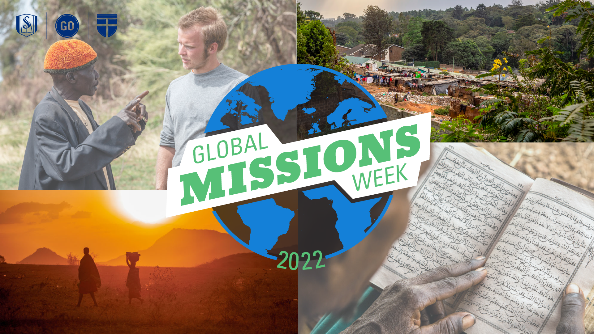

For one week every year, we raise up the task of missions as a focus point for students, faculty, and staff. Global Missions Week gives Southeastern a chance to celebrate that which we hold at the very center of our purpose, equipping students to fulfill the Great Commission.

From January 25-28, the Center for Great Commission Studies has many different events planned for students to learn and experience the work of missionaries. This year, Sub-Saharan Africa is our primary focus, as a team of missionaries joins us from the field. Students will hear from missionaries in their classrooms, have many opportunities to engage them with questions and conversation, and get a few free meals along the way.

Whether you are an on-campus student or learning at a distance, join us this week and learn more about God's work to make his glory known among the nations. Use the schedule below to find out more information about each of the events.
## Schedule of Events

### Tuesday
* [GMW Chapel 1: J.D. Greear](https://www.sebts.edu/news-and-events/chapel/default.aspx)
* [GMW Kick-off Lunch](/gmw-kickoff-lunch/)
* [Global Missions Townhall: A Missionary Panel](/missions-townhall/)

### Wednesday
* [Campus-wide Prayer Walk](/gmw-prayer-walk/)
* [For the Nations: A Night of Worship and Prayer](/worship-night)

### Thursday
* [GMW Chapel 2: Jason Allen](https://www.sebts.edu/news-and-events/chapel/default.aspx)
* [Coffee with a Missionary](/coffee-missionary/)

### Friday
* [Missions in North Korea Seminar](https://www.eventbrite.com/e/nk-missions-seminar-tickets-211108088977)