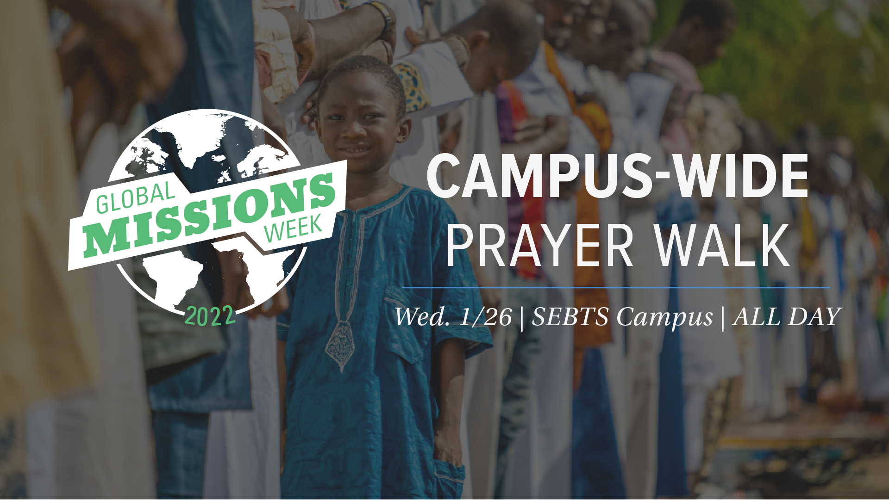

All day Wednesday, Global Missions Week focuses on prayer for the nations. Prayer stations will be located across campus that highlight prayer needs for missions in Sub-Saharan Africa. All students are encouraged to participate in this guided prayer walk by locating these stations and using their smart phone to interact with the prayer points provided. Each station will represent a different prayer need and guide students to the next station.

**Time:** All Day Wednesday

**Location:** Various stations around campus

## Prayer Walk Locations
* [Binkley Chapel](/docs/prayer-station-1/)
* [The Missions Center](/docs/prayer-station-2/)
* [Appleby](/docs/prayer-station-3/)
* [Patterson Hall](/docs/prayer-station-4)
* [The Library](/docs/prayer-station-5/)