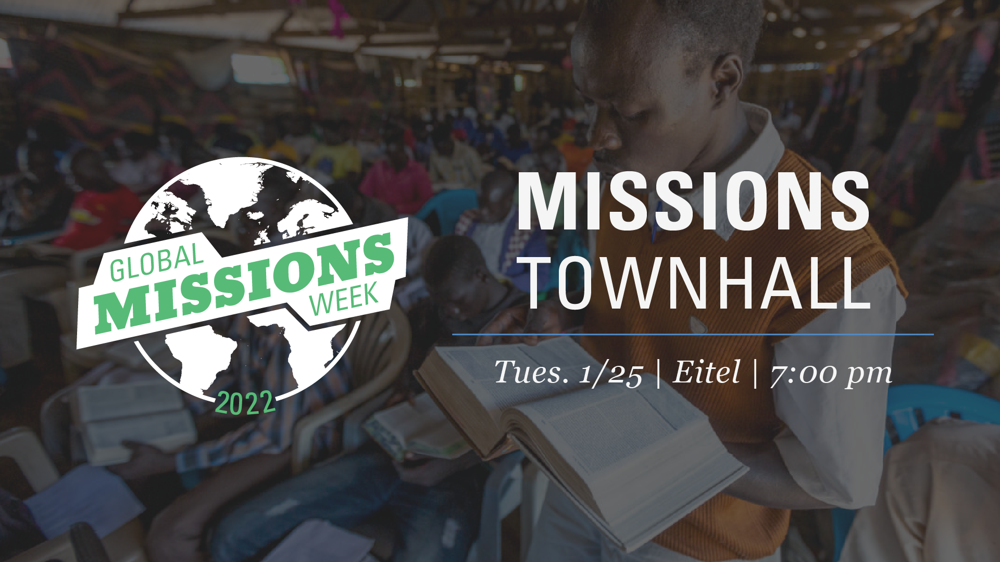

Join us again Tuesday evening for a missions townhall where you will have the opportunity to listen to and interact with our missionary panel. Ask questions concerning the missionary task, particular peoples or cultures in their field of service, or life on the field. This event is not just for our on-campus students. A livestream of the event will incorporate distance students as well and even allow them an opportunity to interact with our missionaries.

### On-Campus Details
**Time:** 7pm

**Location:** Eitel Auditorium

*Free dinner provided*

### Distance Learning Students
We want this to be a special evening for our distance learning students as well. Distance students will be able to view the livestream and participate with their own questions. In fact, we're providing dinner for you too, if you want to attend virtually. After you register for the event, we will provide you with the option to get a gift card for your meal!

### Distance Student Details
**Time:** 7pm

**[Registration Link Here](https://gmwtownhall.eventbrite.com)** 

*Free gift card for dinner provided.*